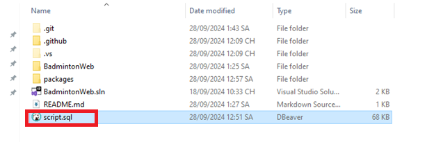
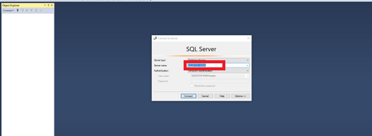
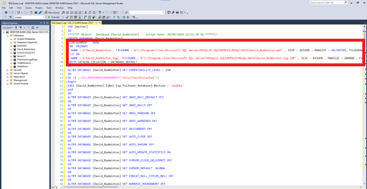
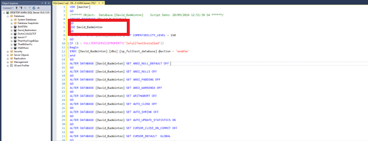
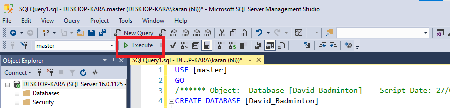
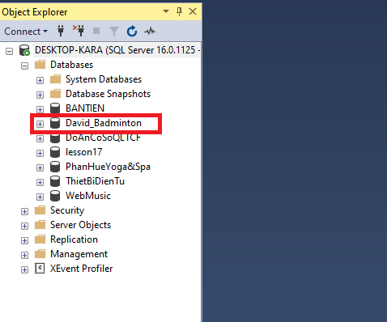
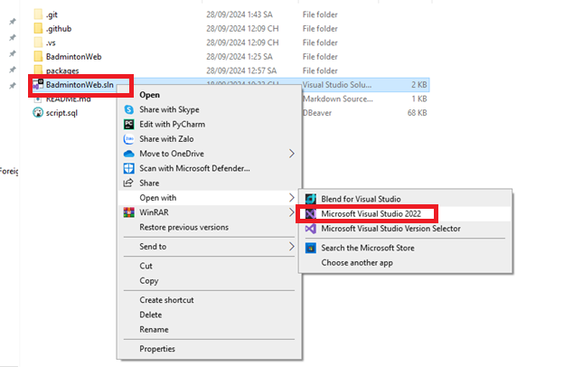
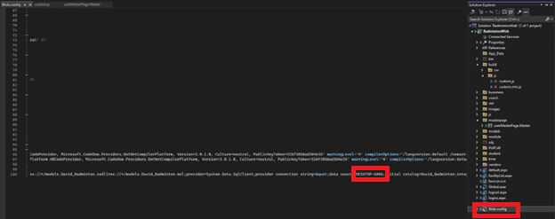
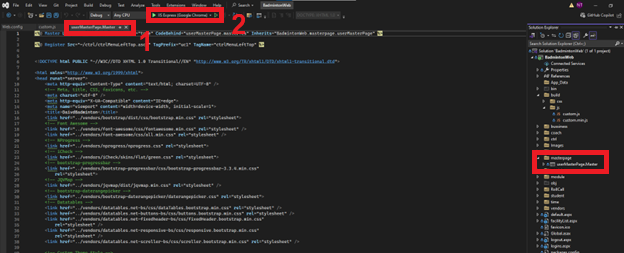
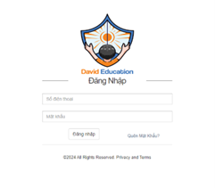

# WebBadminton
Bước 1: Tạo database trên sql server 2019

 
 
Bước 2: ghi lại tên Server name 

 
 
Bước 3: Xóa dòng này

  
  
Bước 4: Thay thế bằng và chạy

GO

USE David_Badminton

GO

  
   
   
Bước 5: kiểm tra đã có database đã có chưa

  
  
Bước 6: Chạy project bằng Visual Studio 2022

  
  
Bước 7: Mở file web.confjg và sửa Server name( bước 2)

  
  
Bước 8: Chạy localhost

  
  
Bước 9: Đăng nhập 
Số điện thoại: 123456789
Mật khẩu: 123456

  
